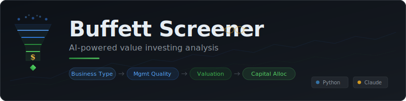

<p align="center">
  
</p>

<p align="center">
  <strong>AI-powered investment analysis pipeline that screens public companies through Warren Buffett's four-layer framework — from SEC 10-K filings to actionable investment reports.</strong>
</p>

<p align="center">
  <a href="#quick-start">Quick Start</a>&nbsp;&nbsp;&bull;&nbsp;&nbsp;
  <a href="#how-it-works">How It Works</a>&nbsp;&nbsp;&bull;&nbsp;&nbsp;
  <a href="#usage">Usage</a>&nbsp;&nbsp;&bull;&nbsp;&nbsp;
  <a href="#example-report">Example Report</a>&nbsp;&nbsp;&bull;&nbsp;&nbsp;
  <a href="#architecture">Architecture</a>&nbsp;&nbsp;&bull;&nbsp;&nbsp;
  <a href="#configuration">Configuration</a>
</p>

<p align="center">
  
  
  
  
  
  
</p>

<br>

## The Problem

There are roughly 4,000 small-to-mid-cap companies trading on U.S. exchanges. Somewhere in that universe are a handful of exceptional businesses — companies with honest management, durable competitive advantages, intelligent capital allocation, and stock prices well below intrinsic value.

Finding them manually means reading thousands of 10-K filings. Nobody does that.

**Buffett Screener does.**

It reads actual SEC filings, applies the same analytical framework Warren Buffett has used for decades, and surfaces only the companies that pass every test. The entire process is automated — from pulling EDGAR filings to generating detailed investment analysis reports.

<br>

## How It Works

The pipeline filters companies through **four increasingly stringent layers**. Each filter eliminates companies that don't meet the bar, so only the best candidates reach the expensive AI analysis stages.

```
   ~3,000 companies ($5M–$5B market cap)
            │
   ┌────────▼─────────┐
   │  FILTER 1         │  SIC code screening, market cap validation,
   │  Business Type    │  10-K filing verification, product-vs-commodity check
   │                   │
   │  ~800 pass        │
   └────────┬─────────┘
            │
   ┌────────▼─────────┐
   │  FILTER 2         │  Three AI agents independently analyze Item 1,
   │  Management       │  Item 1A, and Item 7 of the 10-K for management
   │  Quality          │  transparency, candor, and owner-oriented thinking
   │                   │  Threshold: 65/100
   │  ~150 pass        │
   └────────┬─────────┘
            │
   ┌────────▼─────────┐
   │  FILTER 3         │  Earning power valuation adapted to business type
   │  Valuation        │  (banks, insurers, software, retail, manufacturing)
   │                   │  Moat analysis + intrinsic value estimation
   │                   │  Threshold: 50% margin of safety
   │  ~20 pass         │
   └────────┬─────────┘
            │
   ┌────────▼─────────┐
   │  FILTER 4         │  10-year capital allocation track record:
   │  Capital          │  buyback timing, acquisition discipline,
   │  Allocation       │  debt management, reinvestment returns
   │                   │  Threshold: 60/100
   │  ~5 pass          │
   └────────┴─────────┘
            │
      Final candidates
```

> *"The stock market is a device for transferring money from the impatient to the patient."*
> — Warren Buffett

<br>

## Quick Start

### Prerequisites

| Requirement | Purpose |
|-------------|---------|
| **Python 3.10+** | Runtime |
| **Claude Code CLI** | AI analysis engine ([install guide](https://docs.anthropic.com/en/docs/claude-code)) |
| **Claude Max subscription** | Provides Opus + Sonnet model access |
| **SEC EDGAR identity** | Required by SEC for API access — just your name + email |

### Installation

```bash
# Clone the repository
git clone https://github.com/shauryaagg/buffett-screener.git
cd buffett-screener

# Create and activate virtual environment
python3 -m venv venv
source venv/bin/activate  # On Windows: venv\Scripts\activate

# Install dependencies
pip install -r requirements.txt

# Configure your SEC EDGAR identity (required by SEC for all API requests)
echo 'EDGAR_IDENTITY=YourName your.email@domain.com' > .env

# Initialize the database
python3 run_pipeline.py db init
```

### Your First Analysis

```bash
# Analyze a single company — generates a full markdown report
python3 run_pipeline.py analyze CROX --verbose

# The report is saved to reports/CROX.md
```

That's it. The tool pulls the company's 10-K filing from SEC EDGAR, runs it through all four filters, and produces a detailed analysis report with scores, reasoning, and a final pass/fail verdict.

<br>

## Usage

### Single-Company Analysis

The most common use case — deep analysis of one company:

```bash
# Standard analysis with report saved to reports/
python3 run_pipeline.py analyze MSFT

# Verbose mode — see each filter's progress in real time
python3 run_pipeline.py analyze MSFT --verbose

# Full bypass mode — run ALL 4 filters even if the company fails one
# Useful when you want the complete picture regardless of pass/fail
python3 run_pipeline.py analyze AAPL --full

# Skip saving the report file
python3 run_pipeline.py analyze MSFT --no-save
```

The `--full` flag is particularly useful for research: even if a company fails the valuation filter, you still get the management quality and capital allocation analysis.

### Full Pipeline

Screen the entire small/mid-cap universe:

```bash
# Analyze up to 100 companies from the screened universe
python3 run_pipeline.py run --limit 100

# Resume a paused run (e.g., after hitting rate limits)
python3 run_pipeline.py run --resume <run_id>
```

The pipeline automatically detects rate limits, saves its state to SQLite, pauses, and can resume from the exact company where it left off.

### Status & Results

```bash
# Check pipeline run status
python3 run_pipeline.py status <run_id>

# Export results as JSON
python3 run_pipeline.py results --run-id <run_id>

# Export only companies that passed ALL filters, as CSV
python3 run_pipeline.py results --run-id <run_id> --format csv --passed-only
```

### CLI Reference

| Command | Description |
|---------|-------------|
| `analyze TICKER [-v] [--full] [--save/--no-save]` | Deep analysis on a single company |
| `run [--limit N] [--resume ID]` | Run or resume the full pipeline |
| `status [RUN_ID]` | Show pipeline run progress |
| `results --run-id ID [--format json\|csv] [--passed-only]` | Export analysis results |
| `db init` | Initialize the database |

<br>

## Example Report

When you run `python3 run_pipeline.py analyze CROX --full`, the tool generates `reports/CROX.md`:

### Header

> # CROX — Crocs, Inc.
>
> **Date:** 2026-04-02
> **Price:** $83.56 | **Market Cap:** $4,891.2M
> **Final Result:** Did not pass all filters

### Management Quality Scores

```
Filter 2: Management Quality — PASS (72.5/100)

  Business Clarity     ██████████████░░  7.0/10
  Risk Honesty         ████████████░░░░  6.0/10
  MD&A Transparency    ██████████████░░  7.5/10
  KPI Quality          ██████████████░░  7.0/10
  Tone Authenticity    ██████████████░░  7.0/10
```

### Valuation

> | Metric | Value |
> |--------|-------|
> | Intrinsic Value | $125.00 |
> | Current Price | $83.56 |
> | Margin of Safety | 33.2% |
> | Moat Type | Brand + switching costs |
> | Moat Strength | 6.0/10 |

Each filter section includes the **full reasoning** from the AI agents — not summaries, not truncated excerpts, but the complete analytical chain of thought.

<br>

## The AI Agents

Six specialized Claude agents power the analysis. Each has a distinct analytical role and operates with a "50% owner" mindset — evaluating management as a business partner, not as an outside analyst.

| Agent | Model | Reads | Evaluates |
|-------|-------|-------|-----------|
| **Business Analyst** | Sonnet | Item 1 (Business Description) | Clarity of business model, moat articulation, honest self-assessment |
| **Risk Analyst** | Sonnet | Item 1A (Risk Factors) | Genuine vs. boilerplate risk disclosure, specificity, quantification |
| **MD&A Analyst** | Opus | Item 7 (MD&A) | KPI quality, transparency about problems, capital allocation discussion |
| **Valuation Agent** | Opus | Financials + business context | Business-type-specific intrinsic value, moat type and strength |
| **Capital Allocation Agent** | Opus | 10-year financials + MD&A | Buyback timing, acquisition discipline, debt management, ROIC trends |
| **Business Classifier** | Sonnet | Company description + SIC | Product business vs. commodity classification |

### Agent Philosophy

All agent prompts are grounded in a single framing:

> *You are evaluating this company as if you were a passive 50% owner of this business. Your partner — the active 50% owner (management) — has written you this annual report. You need to determine: Is my partner being straight with me? Do they understand the business? Are they making intelligent decisions with our money?*

This framing produces analysis that focuses on what matters to an owner — not what matters to a trader, an analyst, or a regulator. The full prompts are in [`config/prompts.py`](config/prompts.py).

<br>

## Architecture

```
buffett-screener/
├── cli.py                          # Typer CLI — all user-facing commands
├── run_pipeline.py                 # Entry point
│
├── config/
│   ├── settings.py                 # Thresholds, SIC codes, market cap range
│   └── prompts.py                  # All agent system prompts (Buffett philosophy)
│
├── core/
│   ├── pipeline.py                 # Orchestrator — run, resume, single-ticker analysis
│   ├── models.py                   # Pydantic data models (CompanyInfo, FilterResult, etc.)
│   ├── database.py                 # SQLite — state tracking, results, caching
│   └── report.py                   # Markdown report generator
│
├── data/
│   ├── market_data.py              # Yahoo Finance — prices, market cap, universe building
│   ├── edgar_client.py             # SEC EDGAR — 10-K section extraction + caching
│   └── financial_data.py           # XBRL — 10-year financial metrics, owner earnings
│
├── filters/
│   ├── filter_base.py              # Abstract base with batch processing + rate limit handling
│   ├── f1_business_type.py         # SIC screening + market cap + filing verification
│   ├── f2_management_quality.py    # Multi-agent 10-K qualitative analysis
│   ├── f3_valuation.py             # Earning power valuation + moat assessment
│   └── f4_capital_allocation.py    # 10-year capital allocation intelligence
│
├── agents/
│   └── definitions.py              # Agent runner — calls Claude CLI directly
│
├── tests/                          # 182 tests — models, filters, pipeline, agents, scoring
├── reports/                        # Generated markdown analysis reports (.gitignored)
└── assets/                         # Logo and visual assets
```

### Data Flow

```
                    ┌──────────────┐
                    │ Yahoo Finance│──── Prices, market cap ──────┐
                    └──────────────┘                              │
                                                                  ▼
                    ┌──────────────┐                     ┌────────────────┐
                    │  SEC EDGAR   │──── 10-K text ────▶ │   Pipeline     │
                    └──────────────┘                     │   Orchestrator │
                                                         │                │
                    ┌──────────────┐                     │  F1 → F2 → F3 │
                    │  XBRL Data   │──── Financials ───▶ │  → F4          │
                    └──────────────┘                     └───────┬────────┘
                                                                 │
                    ┌──────────────┐                              │
                    │  Claude CLI  │◀── Analysis requests ───────┘
                    │  (Opus +     │
                    │   Sonnet)    │──── Structured JSON ────────┐
                    └──────────────┘                              │
                                                                  ▼
                                                         ┌────────────────┐
                                                         │    Outputs     │
                                                         │                │
                                                         │  • SQLite DB   │
                                                         │  • Markdown    │
                                                         │  • JSON/CSV    │
                                                         └────────────────┘
```

### Key Design Decisions

| Decision | Rationale |
|----------|-----------|
| **CLI-based agent invocation** | Agents run via `claude --print --output-format json`. No SDK dependencies, no subprocess lifecycle bugs. Each call is stateless and isolated. |
| **Sequential filter elimination** | ~3,000 companies enter; only ~150 reach the expensive AI filters. Early elimination saves 95%+ of compute. |
| **Pause/resume on rate limits** | Pipeline state is checkpointed to SQLite after every company. Rate limits trigger automatic pause; resume picks up at the exact ticker. |
| **10-K section caching** | Extracted filing text is cached in the database. Repeat runs on the same company skip EDGAR entirely. |
| **Multi-model strategy** | Sonnet handles high-volume, per-dimension scoring. Opus handles the hard qualitative synthesis — valuation, capital allocation, and MD&A assessment. |
| **No truncation in reports** | Agent reasoning is stored and reported in full. A 3,000-word valuation analysis is more useful than a 200-character summary. |
| **`--full` bypass mode** | Users can override filter gates to get the complete four-filter analysis regardless of pass/fail — essential for research. |

<br>

## Scoring Methodology

### Filter 2: Management Quality (0–100)

A weighted composite of five dimensions, each scored 0–10 by independent AI agents reading different sections of the 10-K:

| Dimension | Weight | 10-K Section | What It Measures |
|-----------|--------|-------------|------------------|
| MD&A Transparency | 16.7% | Item 7 | Candid discussion of results, problems, and outlook |
| KPI Quality | 16.7% | Item 7 | Are reported metrics meaningful to an owner? |
| Tone Authenticity | 16.7% | Item 7 | Partner-like communication vs. PR-speak |
| Business Clarity | 25% | Item 1 | Can a layperson understand how money is made? |
| Risk Honesty | 25% | Item 1A | Specific, quantified risks vs. legal boilerplate |

**MD&A dimensions are weighted 50% collectively** because Item 7 is where management's thinking is most visible. **Threshold: 65/100.**

### Filter 3: Valuation

The valuation agent adapts its framework to the business type:

| Business Type | Primary Framework | Key Metrics |
|--------------|-------------------|-------------|
| Banks | Price-to-book vs. sustainable ROE | Net interest margin, loan losses, efficiency ratio |
| Insurers | Float value + underwriting profitability | Combined ratio, float growth, investment returns |
| Software/SaaS | Earning power at steady-state margins | Gross margins, retention, switching costs |
| Retailers | Unit economics + rollout potential | Same-store sales, store-level ROIC |
| Manufacturers | Pricing power + margin trajectory | Gross margin trends, brand strength |
| Mature/no-growth | Owner earnings yield | FCF yield, capital intensity |

**Threshold: 50% margin of safety** — the stock must trade below half of estimated intrinsic value. This ensures you can be substantially wrong and still do well.

### Filter 4: Capital Allocation (0–100)

Equal-weighted analysis of five capital allocation dimensions across 10 years of data:

| Dimension | What It Measures |
|-----------|-----------------|
| Buyback Quality | Were shares repurchased below intrinsic value, or at all-time highs? |
| Capital Return | When ROIC declines, does management return capital or hoard cash? |
| Acquisition Quality | Did acquisitions create per-share value or destroy it? |
| Debt Management | Is leverage prudent relative to earnings stability? |
| Reinvestment Quality | Are incremental dollars deployed at returns above cost of capital? |

**Threshold: 60/100.** The key diagnostic: if the share count is up over 10 years, management has been diluting shareholders regardless of what their buyback press releases say.

<br>

## Configuration

All thresholds and settings are in [`config/settings.py`](config/settings.py):

| Setting | Default | Description |
|---------|---------|-------------|
| `MARKET_CAP_MIN` | $5M | Minimum market cap for the universe |
| `MARKET_CAP_MAX` | $5B | Maximum market cap for the universe |
| `F2_MIN_SCORE` | 65 | Management quality threshold (0–100) |
| `F3_MARGIN_OF_SAFETY` | 0.50 | Required margin of safety (50%) |
| `F4_MIN_SCORE` | 60 | Capital allocation threshold (0–100) |
| `RATE_LIMIT_PAUSE_HOURS` | 2 | Hours to pause when rate-limited |

### Environment Variables

Create a `.env` file in the project root:

```bash
# Required — SEC mandates identification for EDGAR API access
EDGAR_IDENTITY=YourName your.email@domain.com
```

### SIC Code Filtering

The screener uses Standard Industrial Classification codes to include product-based businesses and exclude commodity businesses:

**Included** (product businesses with moats):
- Banks (SIC 6000–6199) — lending/deposit franchises
- Insurance (SIC 6300–6399) — underwriting is a product
- Manufacturing (SIC 2000–3999) — branded goods
- Retail/Wholesale (SIC 5000–5999)
- Services & Technology (SIC 7000–8999)

**Excluded** (undifferentiated commodities):
- Agriculture, Forestry, Fishing (SIC 100–999)
- Mining & Extraction (SIC 1000–1499)
- Oil & Gas (SIC 1300–1389)
- Petroleum Refining (SIC 2911)
- Commodity Metals (SIC 3312–3317)

<br>

## Testing

The project includes a comprehensive test suite covering models, database operations, filter logic, pipeline orchestration, agent error handling, JSON extraction, scoring, and data fallback mechanisms.

```bash
# Run the full test suite (182 tests)
python3 -m pytest tests/

# Verbose output
python3 -m pytest tests/ -v

# Run a specific test file
python3 -m pytest tests/test_pipeline.py

# Run tests matching a pattern
python3 -m pytest -k "bypass"
```

### Test Coverage Areas

| Test File | What It Covers |
|-----------|---------------|
| `test_pipeline.py` | Rate limit detection, pipeline status, bypass_filters behavior (14 scenarios) |
| `test_filters.py` | Filter evaluation, EDGAR fallback, pass/fail logic |
| `test_agent_retry.py` | Agent CLI invocation, error handling, JSON extraction |
| `test_market_data_validation.py` | Yahoo Finance data validation, edge cases |
| `test_edgar_fallback.py` | Fallback to yfinance when EDGAR has no data |
| `test_models.py` | Pydantic model creation, validation, constraints |
| `test_scoring.py` | Management quality and capital allocation weighted scoring |
| `test_database.py` | SQLite operations, state persistence |
| `test_extract_json.py` | JSON parsing from various agent response formats |

<br>

## Limitations

- **SEC filings only** — Companies that file with banking regulators (FDIC/OCC) instead of the SEC may not have 10-K data available. The tool detects this and reports it clearly.
- **Rate limits** — Claude Max subscriptions have token throughput limits. Large pipeline runs will pause and resume automatically, but full universe screening takes time.
- **AI analysis quality** — Agent outputs are probabilistic. The same company analyzed twice may receive slightly different scores. Use the full reasoning (not just scores) to evaluate quality.
- **U.S. equities only** — The pipeline uses SEC EDGAR and U.S. exchange data. International companies are not supported.
- **No real-time data** — Market data from Yahoo Finance may be delayed. This is a value investing tool, not a trading system.

<br>

## Contributing

Contributions are welcome. If you're considering a significant change, please open an issue first to discuss the approach.

```bash
# Fork the repository, then:
git clone https://github.com/your-username/buffett-screener.git
cd buffett-screener
python3 -m venv venv
source venv/bin/activate
pip install -r requirements.txt

# Run tests before submitting
python3 -m pytest tests/ -v

# Submit a pull request against main
```

### Guidelines

- All changes must pass the existing test suite
- New features should include tests
- Keep the codebase simple — no abstractions without a concrete problem to solve
- Agent prompts are in `config/prompts.py` — improvements to analytical quality are especially welcome

<br>

## Disclaimer

This tool is for **educational and research purposes only**. It does not constitute financial advice. AI-generated analysis may contain errors, hallucinations, or outdated information. Always conduct your own due diligence before making investment decisions. Past performance does not guarantee future results.

The authors are not registered investment advisors. Use of this tool does not create an advisory relationship.

<br>

## License

This project is licensed under the [MIT License](LICENSE).

---

<p align="center">
  <sub>Built with <a href="https://www.anthropic.com/claude">Claude</a>&nbsp;&nbsp;&bull;&nbsp;&nbsp;Data from <a href="https://www.sec.gov/edgar">SEC EDGAR</a> & <a href="https://finance.yahoo.com">Yahoo Finance</a>&nbsp;&nbsp;&bull;&nbsp;&nbsp;Inspired by the Oracle of Omaha</sub>
</p>
